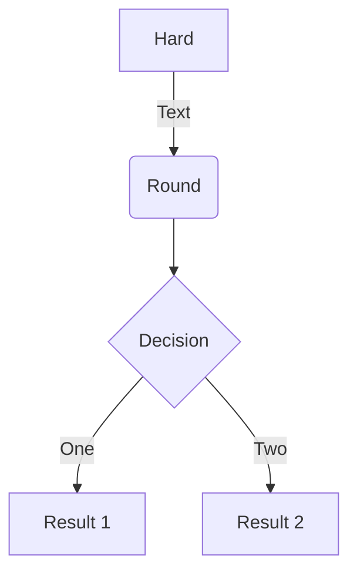
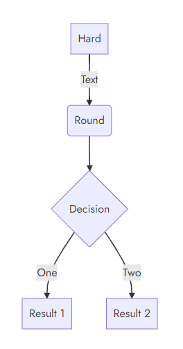

## Better UX navigation




No more scrolling to the bottom of a page  to get to the next page! The navigation parts (global, section, and page) are now all available at the top of a browser window (all screen sizes). This setup also provides for more room for additional navigation elements (all navigation parts).

[Menus →]()

## Multilingual and i18n support



Doks now is fully prepared for multilingual and i18n support.

[Multilingual Mode →]()

## Versioned documentation support



Doks now is fully prepared for versioned documentation support.

[Versioned Documentation →]()

## Global alert



The global alert is now visible on all pages (not only the homepage) when activated. Switch it on by setting `alert = true` and make it dismissible by setting `alertDismissable = true` in `./config/_default/params.toml`.

[Alerts →]()

## Mermaid diagrams

You can now add Mermaid diagrams and visualizations by using a shortcode (handy for adding extra classes) or code fences. Mermaid support is switched off per default. Activate it by setting `mermaid = true` in the front matter of a page.

````md

````



_Note, this is an image, because Mermaid support is switched off on this site._

[Mermaid →]()

## Videos shortcode

You can now add locally hosted videos by using a shortcode.

```md

```



[Videos →]()

## Images markdown support

Now, you can also (next to using the image shortcodes) add an image using markdown (portability!). An `` element is used for small images, a `<figure>` element for large images.

```md

```


[Images →]()

## Other features and fixes

- Update meta tags (following setup [Yoast](https://developer.yoast.com/))
- Make section navigation collapsible (optionally)
- Extend alert shortcode (inline, next to named parameter)
- Automatically add copy button for code blocks (dropped copy shortcode)
- Better dark mode support (no more [FART](https://css-tricks.com/flash-of-inaccurate-color-theme-fart/))
- Replace [hugo-bin](https://github.com/fenneclab/hugo-bin) with [hugo installer](https://github.com/dominique-mueller/hugo-installer) (verifies checksum & runs health check when installing)
- Migrate to [FlexSearch v0.7.2](https://github.com/nextapps-de/flexsearch)
- Migrate to [highlight.js v11.2.0](https://github.com/highlightjs/highlight.js)
- Update to [Hugo v0.88.1](https://gohugo.io/news/0.88.1-relnotes/)
- Update to [Bootstrap 5.1.2](https://blog.getbootstrap.com/2021/10/05/bootstrap-5-1-2/)

[Full changelog →](https://github.com/h-enk/doks/blob/master/CHANGELOG.md)

## What's next

- Add subnavigation to menus (main + section)
- Automatically generate menus (main + section)
- Add Algolia Search (next to FlexSearch) as an option
- Update blog pages (list + single)
- Docs docs docs!

[Milestones →](https://github.com/h-enk/doks/milestones)

## Contributors

Thanks for all contributions to discussions, bugfixes, features, and documentation!

[32u2](https://github.com/32u2), [AsbjornOlling](https://github.com/AsbjornOlling), [deining](https://github.com/deining), [FileFabrik](https://github.com/FileFabrik), [limichange](https://github.com/limichange), [LunaticMuch](https://github.com/LunaticMuch), [mikepianka](https://github.com/mikepianka), [mroswell](https://github.com/mroswell), [OCram85](https://github.com/OCram85), [rslifka](https://github.com/rslifka), [sharjeelaziz](https://github.com/sharjeelaziz), [soichih](https://github.com/soichih), [TheTimeWalker](https://github.com/TheTimeWalker), [umatare5](https://github.com/umatare5), [Yvand](https://github.com/Yvand), and [Zerotask](https://github.com/Zerotask) :muscle:

## Become a backer

Help Doks grow further by supporting us on [Open Collective](https://opencollective.com/doks). Thanks!
