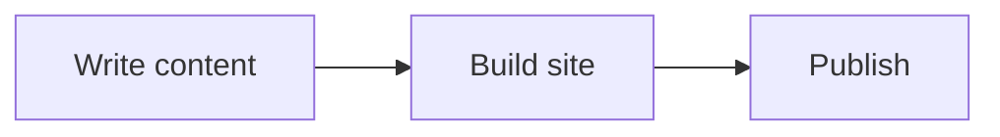
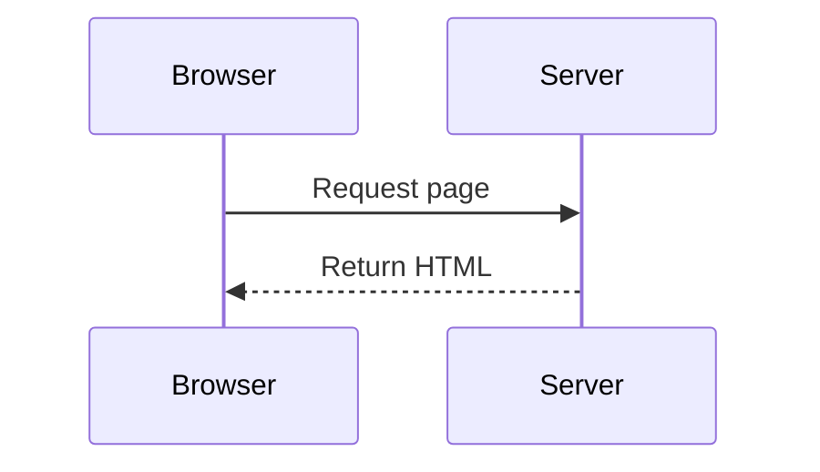
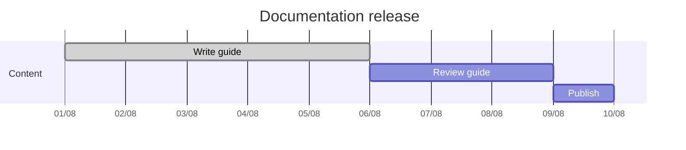
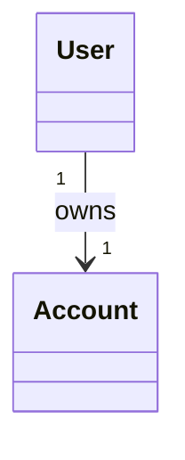
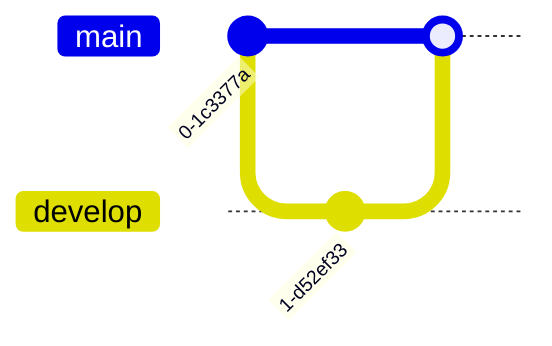

Use a fenced code block with the `mermaid` language identifier to add a diagram.

## Usage

````md

````

No additional page or site settings are required.

## Examples

Mermaid supports many [diagram types](https://mermaid.ai/open-source/intro/#diagram-types).

### Flowcharts

Use `flowchart` to show processes and relationships:






````md

````

### Sequence diagrams

Use `sequenceDiagram` for interactions between participants:







````md

````

### Gantt charts

Use `gantt` to show project tasks and dependencies:







````md

````

### Class diagrams

Use `classDiagram` to describe relationships between types:







````md

````

### Git graphs

Use `gitGraph` to document branches and commits:






````md

````

## Learn more

<!-- markdownlint-disable MD034 -->






<!-- markdownlint-enable MD034 -->
