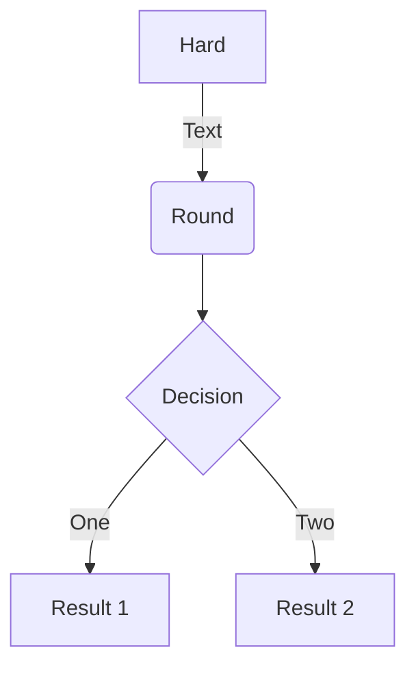



## At request time

### Install

Install [Mermaid](https://github.com/mermaid-js/mermaid): `npm install mermaid -D`.

### Enable

Mermaid support is switched off per default. For performance reasons, the script is only loaded on pages that need it (so, not site wide). Activate it by setting `mermaid = true` in the front matter of a page.

### Use shortcode

```md

graph TD
  A[Hard] -->|Text| B(Round)
  B --> C{Decision}
  C -->|One| D[Result 1]
  C -->|Two| E[Result 2]

```

Note that, you can add Bootstrap classes to the shortcode, for e.g. aligning the graph or setting the background color.



_Note, this is an image, because Mermaid support is switched off on this site._

### Use code fences

````md

````


_Note, this is an image, because Mermaid support is switched off on this site._

## At build time

If you don't need to generate charts and diagrams at request time, use the Mermaid Live Editor to generate charts and diagrams for use at build time.

### Workflow

1. Generate your chart /diagram in the [Mermaid Live Editor](https://mermaidjs.github.io/mermaid-live-editor)
2. Save the definition file (for future editing purposes) + png in your [page bundle](https://gohugo.io/content-management/page-bundles/)
3. Insert the png in your page with the [small image shortcode](https://getdoks.org/docs/recipes/images/#add-a-small-image).

## Usage

- [Flowchart](https://mermaid-js.github.io/mermaid/#/flowchart)
- [Sequence diagram](https://mermaid-js.github.io/mermaid/#/sequenceDiagram)
- [Class diagram](https://mermaid-js.github.io/mermaid/#/classDiagram)
- [State diagram](https://mermaid-js.github.io/mermaid/#/stateDiagram)
- [Entity Relationship Diagram](https://mermaid-js.github.io/mermaid/#/entityRelationshipDiagram)
- [User Journey Diagram](https://mermaid-js.github.io/mermaid/#/user-journey)
- [Gantt chart](https://mermaid-js.github.io/mermaid/#/gantt)
- [Pie chart](https://mermaid-js.github.io/mermaid/#/pie)
- [Requirement Diagram](https://mermaid-js.github.io/mermaid/#/requirementDiagram)

## Resources

- [Mermaid](https://mermaid-js.github.io/mermaid/#/)
- [Mermaid Live Editor](https://mermaidjs.github.io/mermaid-live-editor)
